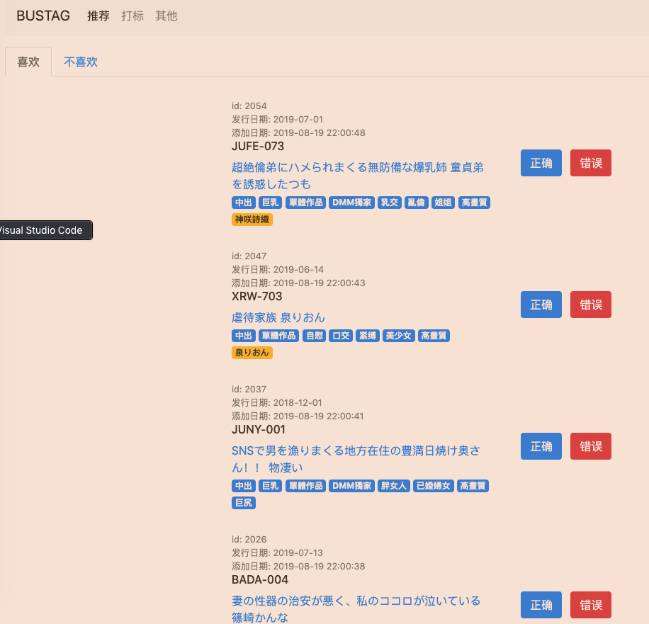
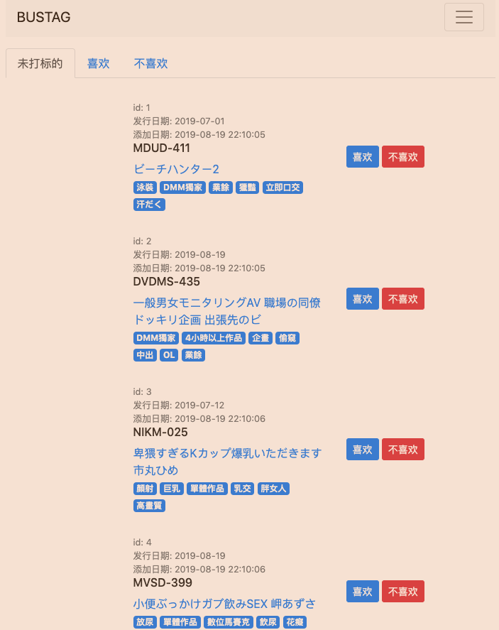
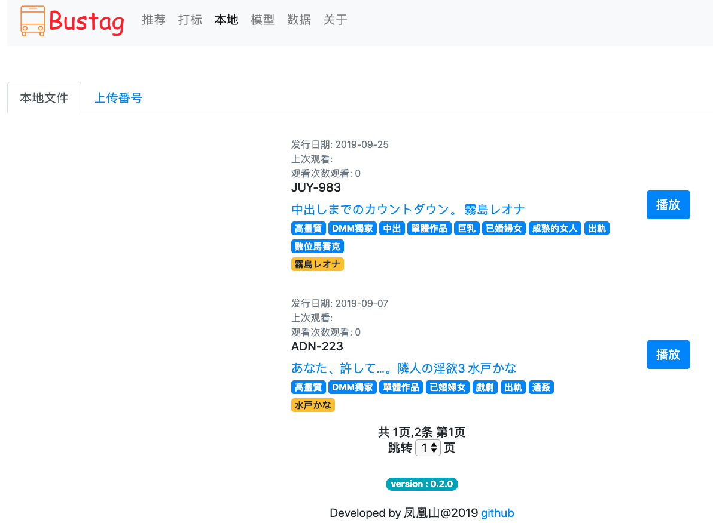
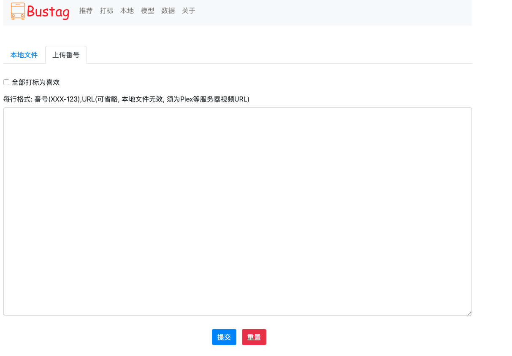
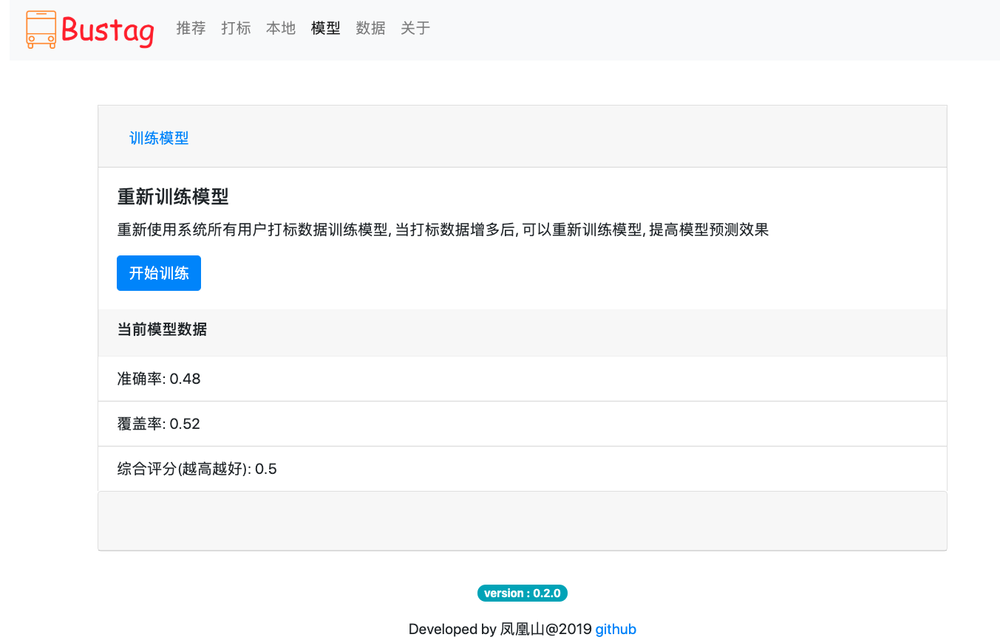
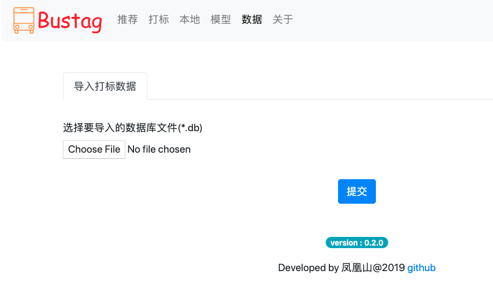

# 基于机器学习的老司机车牌自动推荐系统


**Bustag** 是一个基于我开发的 python 异步爬虫框架开发[aspider](https://github.com/gxtrobot/aspider)的自动车牌推荐系统, 系统原理为定时爬取最新车牌信息, 然后可以对车牌进行打标(标示是否喜欢), 打标车牌到一定数量可以进行训练并生成模型, 以后就可以基于此模型自动对下载的车牌进行预测是否喜欢, 可以过滤掉大量不喜欢的车牌, 节约时间

### Python in Action 学习视频发布
[https://github.com/gxtrobot/pyinaction](https://github.com/gxtrobot/pyinaction)

为提高解决问题效率 ,建了个qq群

**QQ群: 941894005**

注意, 该群仅讨论**python学习, 爬虫开发, aspider 框架学习开发, Bustag系统bug, 运行问题**等, 请勿讨论无关主题

**免责声明:
本软件仅用于技术学习使用，禁止用于商业用途，使用本软件所造成的的后果由使用者承担！
如果你觉得这个软件不错, 可以请我喝杯冰阔落 ^_^.**

<p align="center">


</p>

# 紧急提示


# windows, mac 绿色版下载地址
  链接: https://pan.baidu.com/s/1pqarq7fOXjsbad0WN4Uaaw 提取码: budu

  压缩包密码: gxtrobot

# docker 版本同步更新
运行 ```docker pull gxtrobot/bustag-app:latest``` 后重新启动项目即可

# 使用须知
只需在data目录下创建[config.ini](https://raw.githubusercontent.com/gxtrobot/bustag/master/data/config.ini), 然后启动系统, 访问localhost:8000

### 使用视频 

链接: https://pan.baidu.com/s/1pqarq7fOXjsbad0WN4Uaaw 提取码: budu

在视频目录下

- 群晖docker安装bustag 视频发布(2019-10-16)
- bustag最新使用视频发布(2019-10-15)  
- linux/mac docker版本安装 
- win10 docker版本安装

## 更新

### release 0.2.1(2019-10-12)
- 修复几个bug
- 增加系统启动错误信息打印, 方便排查

该版本主要是为了更好发现错误, 如果能正常运行的可以不更新

### release 0.2.0(2019-10-7)
- 一些bug修复, 如数据解析不全等
- 多处页面优化(封面图点击放大, 页面跳转等等)
- 启动检查config.ini, 没有自动退出
- 手动本地文件管理, 增加手动添加番号及本地路径功能
- 增加今日更新, 推荐数量
- 手动上传番号, 直接打标为喜欢
- 添加logo
- 增加打标数据库导入功能

#### 注意事项
- **v0.2.0 版本有数据库结构变化, 所以和老版本数据库不兼容, 建议新建一个目录运行新版, 如需要愿数据库打标数据, 可以通过数据页面, 导入数据库完成打标数据导入**

### 2019-9-6 0.1.1版发布
  - 修复部分bug
  - 增加windows(只在win10下测试过)), mac 绿色版, 解压直接使用,


## 系统功能

- 自动抓取最新车牌信息, 抓取频率可以自定义
- 系统启动后自动开启一次下载, 然后安装设置抓取频率下载
- 车牌打标功能
- 模型训练, 基于当前所有打标数据训练模型
- 有了模型后, 自动预测判断是否喜欢
- 手动上传番号, 本地文件管理
- 数据库打标数据导入
- Docker 镜像一键运行, 省去新手配置项目的麻烦
- 项目访问地址: localhost:8000

## 系统截图(隐藏了左边封面图片)

- 推荐页面
  

- 打标页面
  

- 本地文件页面
  

- 本地番号, 链接上传页面
  

- 模型页面
  

- 数据页面
  

## 如何运行项目

  ###  windows , mac绿色版如何使用
  下载zip包后解压缩到任意目录, 然后在目录下的data目录里, 创建文件[config.ini](https://raw.githubusercontent.com/gxtrobot/bustag/master/data/config.ini)
    - windows 版: 执行(双击)bustag.exe
    - mac 版: 执行(双击)bustag
    - 浏览器访问: localhost:8000, 访问成功说明运行正常, 如果访问不成功, 可以看bustag程序窗口有无报错

  ### 本地源代码安装
  懂 python 开发的可以 clone 本项目, 建立一个虚拟环境并按照 requirements.txt 的 python 包后, 在项目根目录下
  直接运行

```
python bustag/app/index.py

或者安装了gunicorn
gunicorn bustag.app.index:app --bind='0.0.0.0:8000'
```

 ### 使用 docker 运行(推荐)

  1. 建立一个目录, 如 bustag, 然后在该目录下建一个子目录 data, data 目录用于保存配置文件以及下载数据的数据库
  2. 在 data 下需要建立一个文件, [config.ini](https://raw.githubusercontent.com/gxtrobot/bustag/master/data/config.ini), 该文件用于设置爬取的初始地址, 以及每次下载的最大数量
  3. 运行命令

  ```
  linux, mac
    docker run --rm -d -e TZ=Asia/Shanghai -e PYTHONUNBUFFERED=1 -v $(pwd)/data:/app/data -p 8000:8000 gxtrobot/bustag-app

    windows powershell
    docker run --rm -d -e TZ=Asia/Shanghai -e PYTHONUNBUFFERED=1 -v ${PWD}/data:/app/data -p 8000:8000 gxtrobot/bustag-app


注: -e TZ=Asia/Shanghai , 指的是docker container的时区设置, 如果需要其他时区可自行设置, 如果不设置默认为UTC时区
    -e PYTHONUNBUFFERED=1 , 指的是显示所有log输出, 如果不设置, 那只能看到debug 的错误log日志
  ```

## 如何使用项目

### 请按照以下顺序

1. 到打标页面进行打标, 达到一定数量(喜欢+不喜欢), 比如 300
2. 到其他页面训练模型
3. 坐等系统自动推荐
4. 在推荐页面进行确认(确认过的数据转为打标数据)
5. 积累更多打标数据, 再次训练模型, 打标数据越多模型效果越好

### data 目录文件说明

```
|____bus.db
|____config.ini
|____crontab.txt
|____model
| |____ label_binarizer.pkl
| |____model.pkl
```

- config.ini, (系统配置文件, 必须, 系统启动时候需要此文件, [参考文件](./data/config.ini))
  - root_path: 制定bus网站主页地址, 爬虫起始地址, 由于地址可能变化, 确保本机能够访问该地址, 如果需要代理才能访问, 必须开启全局代理, 系统本身无代理设置
  - count: 每次下载总数, 建议不要太多, 500以下比较好
  - interval: 每次下载间隔时间, 单位为秒, 建议不要低于1800秒

- bus.db (数据库文件, 可选, 但是可以放一个[现成的库, 有 2000 条数据, 方便直接开始打标, 不需要等下载](./data/bus.db))
- crontab.txt (定时下载配置文件, 可选, [参考例子](./docker/crontab.txt))
- model 目录(系统训练生成的模型)

## 其他问题

1. 改变自动下载的频率
   修改config.ini的interval 参数即可, 单位是秒, 比如修改为一小时更新一次为 `interval=3600`

2. 改变下载初始 url
   因为该 url 会经常改变, 所有系统的 config.ini -> download -> root_path 定义了初始 url, 可以根据需要改变

3. 是否可以使用代理
   目前系统还没加入代理功能, 不过可以在 docker 设置代理访问

4. 下载数量多少合适
   鉴于爬虫的稳定性, 不建议每次下载太多, 也可能会给 bus 服务器带来压力, 如果需要, 初次使用可以加大到 1000, 这样可以下载多点初始数据用于打标, 后面可以改为 300

5. 模型效果如何
   经过一些测试, 最终使用了 KNN 模型, 效果的话谈不上非常好, 在准确率上还可以, 不过召回率相对低一些, 也就是说推荐的准确率相对高点, 但是会漏掉一些喜欢的数据.
   所以, 鉴于定期对推荐数据进行确认, 经过确认后, 推荐数据转为打标数据, 然后重新训练,打标数据越多效果越好

6. 要多少打标数据才能训练模型
   建议至少达到 300 打标数据(包括喜欢, 不喜欢), 如何尝试训练模型, 并查看模型效果值, 如不满意可以增加训练数据并重新训练

7. 模型用了什么数据训练
   模型目前主要使用了各种标签数据, 比如影片分类, 女优名等等, 目前没有使用到标题

8. 如何改变服务器运行端口
   服务器默认为 8000 端口, 如果需要改变, 可以修改启动 docker 容器命令, 比如 8000

```
修改为8000端口, 注意:后面的8000不要变, 然后可以通过localhost:8000访问

docker run --rm -d -v $(pwd)/data:/app/data -p 8000:8000 gxtrobot/bustag-app
```

9. 如何备份数据库
   系统使用的数据库保存在 data 目录下的 bus.db, 如果有需要可以将此文件拷贝一份作为备份, 比如在打标测试模型时, 如果不想使用当前打标数据, 可以将数据库恢复到原来的版本
   该数据库为 sqlite 格式, 可以直接使用软件打开, 比如 [DB Browser for Sqlite](https://sqlitebrowser.org/), 该软件支持多平台
